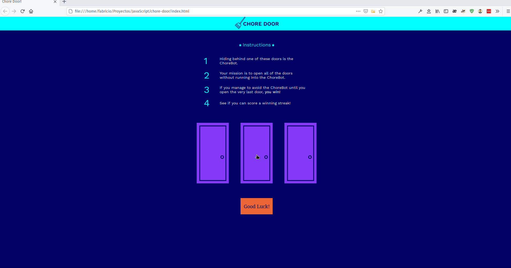

<!-- PROJECT SHIELDS -->
<!--
*** "reference style" links are used for readability.
*** Reference links are enclosed in brackets [ ] instead of parentheses ( ).
*** See the bottom of this document for the declaration of the reference variables
*** for contributors-url, forks-url, etc. This is an optional, concise syntax you may use.
*** https://www.markdownguide.org/basic-syntax/#reference-style-links
-->

[![Contributors][contributors-shield]][contributors-url]
[![Forks][forks-shield]][forks-url]
[![Stargazers][stars-shield]][stars-url]
[![Issues-open][issues-open-shield]][issues-open-url]
[![Issues-closed][issues-closed-shield]][issues-closed-url]

# chore-door

> Single-page website that plays a fully-functional game. 

Additional description about the project and its features.

## Built With

- HTML
- CSS
- Vanilla JS

## Live Demo

[Live Demo Link](https://chore-door-game.surge.sh)

## Getting Started

> To get a local copy up and running follow these simple example steps:

### Install

- Just download the project files and open `index.html`.
- Follow the in-game instructions

### Run tests

No tests have been added to this project

## Author

👤 **Fabricio Garcia**

- Github: [@fabricio-garcia](https://github.com/fabricio-garcia)
- Twitter: [@this_fab](https://twitter.com/this_fab)
- Linkedin: [@fabricio-garcia](https://linkedin.com/fabricio-garcia)

## 🤝 Contributing

Contributions, issues and feature requests are welcome!

Feel free to check the [issues page](issues/).

## Show your support

Give a ⭐️ if you like this project!

## Acknowledgments

- [Codecademy](https://www.codecademy.com/)

## 📝 License

This project is [MIT](https://opensource.org/licenses/MIT) licensed.

<!-- MARKDOWN LINKS & IMAGES -->
<!-- https://www.markdownguide.org/basic-syntax/#reference-style-links -->

[contributors-shield]: https://img.shields.io/github/contributors/fabricio-garcia/chore-door?style=plastic
[contributors-url]: https://github.com/fabricio-garcia/chore-door/graphs/contributors
[forks-shield]: https://img.shields.io/github/forks/fabricio-garcia/chore-door?style=plastic
[forks-url]: https://github.com/fabricio-garcia/chore-door/network/members
[stars-shield]: https://img.shields.io/github/stars/fabricio-garcia/chore-door?style=plastic
[stars-url]: https://github.com/fabricio-garcia/chore-door/stargazers
[issues-open-shield]: https://img.shields.io/github/issues/fabricio-garcia/chore-door?style=plastic
[issues-closed-url]: https://github.com/fabricio-garcia/chore-door/issues
[issues-closed-shield]: https://img.shields.io/github/issues-closed/fabricio-garcia/chore-door?style=plastic
[issues-open-url]: https://github.com/fabricio-garcia/chore-door/issues
